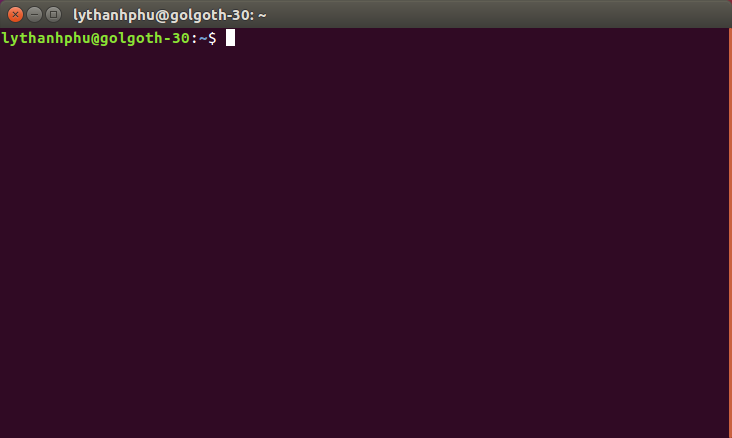
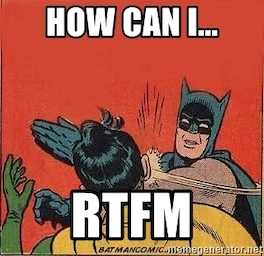
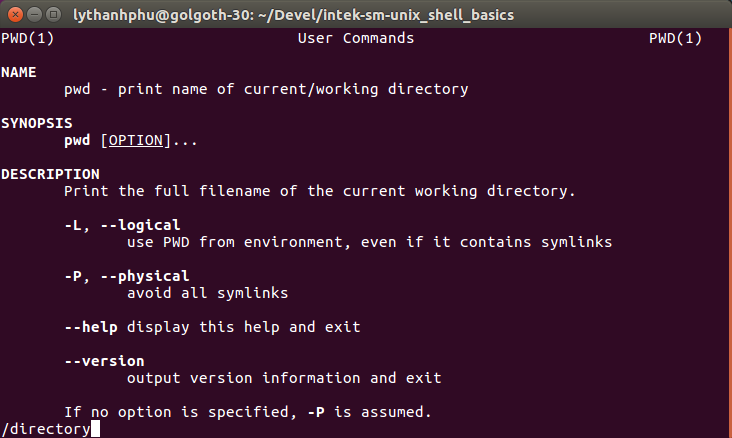
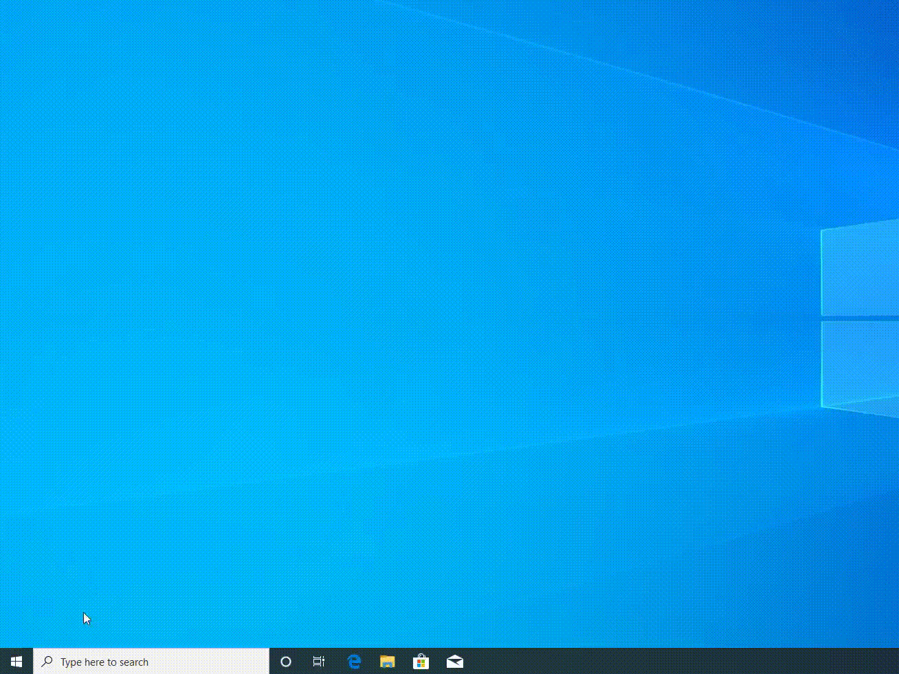
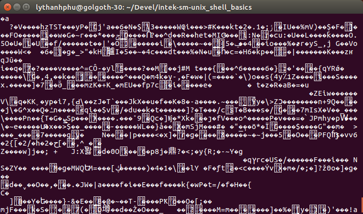

# Introduction to The Shell


Real hackers don't use a mouse and a [Graphical User Interface (GUI)](https://en.wikipedia.org/wiki/Graphical_user_interface) application to control a computer. They use a keyboard and a [Command-Line Interface (CLI)](https://en.wikipedia.org/wiki/Command-line_interface): a **terminal emulator** with a **shell** application.

## Terminal

A [terminal emulator](https://en.wikipedia.org/wiki/Terminal_emulator), or _terminal_ for short, is an application that provides a visual interface between the user and an operating system. The terminal handles text (_character-based_) input coming from the keyboard and displays text output to its windows. The terminal runs a specific program, a **shell**, to interpret commands that a user has typed.

There are many [terminal applications for Windows, Mac OS X, and Linux](https://en.wikipedia.org/wiki/List_of_terminal_emulators). For instance:

| [Windows: Command Prompt](https://en.wikipedia.org/wiki/Cmd.exe)     | [Mac OS X: iTerm2](https://en.wikipedia.org/wiki/ITerm2) | [Linux: GNOME Terminal](https://en.wikipedia.org/wiki/GNOME_Terminal)                    |
| -------------------------------------------------------------------- | -------------------------------------------------------- | ---------------------------------------------------------------------------------------- |
|  |          |  |

## Shell

A [shell](<https://en.wikipedia.org/wiki/Shell_(computing)>) is a program that lets you type a command, possibly followed by some parameters, and press the `Enter`/`Return` key to execute that command. The shell processes the command and returns output. You can then type a new command. A shell supports many advanced features such as running script files, running commands in the background, chaining commands together, etc.


One of the most widely used shell for Unix-like operating systems is [`bash`](<https://en.wikipedia.org/wiki/Bash_(Unix_shell)>). Besides `bash`, there are [other shell programs](https://en.wikipedia.org/wiki/Comparison_of_command_shells) that can be installed in your operating system.

The problem is that shells may use different interpreters, different command syntax and levels of programmability. For instance, if you want to list the files of a directory, you have to type the command `dir` with `Command Prompt` (Windows), while you have to type the command `ls` with `bash` (Unix-like).

## POSIX Shell

The [POSIX](https://en.wikipedia.org/wiki/POSIX) standard specifies its [standard shell](http://pubs.opengroup.org/onlinepubs/9699919799/utilities/V3_chap02.html) that most Unix-like shells respect. POSIX makes task of cross-platform software development easy.

You will need to use a POSIX shell to complete this mission.

_Note: The default shell of the Windows `Command Prompt` terminal is not POSIX compliant. You CANNOT use it to complete this mission. But, thankfully, with the help of Ubuntu, [Linux command-line comes to Windows](https://itsfoss.com/bash-on-windows/). You SHOULD install [Windows System for Linux (WSL)](https://docs.microsoft.com/en-us/windows/wsl/install-win10) and a Linux distribution such as [Ubuntu](https://www.microsoft.com/vi-vn/p/ubuntu/9nblggh4msv6). Once installed, you can launch `Command Prompt` and enter the command `bash` to run the Bash shell:_


# How can I?... Read The F\*\*king Manual!

 

_"If you care enough to ask, you should care enough to learn; my time is valuable, treat it as such."_

[RTFM](https://en.wikipedia.org/wiki/RTFM) is an expression typically used as a response, on mailing lists and in chat rooms, when a newbie asks questions for which the answers could have easily been figured out on their own with minimal effort, for instance, by reading the ad hoc documentation.

People who say "RTFM" might be considered rude, but the true rude ones are the annoying people who take absolutely no self-responsibility and expect to have all the answers handed to them personally.

```text
noob: How do I create a directory tree such as "./a/b/c/d" with the command "mkdir"?
1337: Dude, seriously... RTFM "man mkdir"!!!
```

Always try to find answers to a naive question by searching on the Internet, such as [Google](https://www.google.com/), [Stack Overflow](https://stackoverflow.com/), or any proper documentation where this question might have already been answered.

For instance, never ask how a particular Unix shell command works without minimal research on your own. The [`man` page](https://en.wikipedia.org/wiki/Man_page) should already provide all the [documentation about this command](https://www.youtube.com/watch?v=uJnrh9hAQR0) with all the arguments this command supports.

From your terminal application, enter `man` and the command name you would like to display the user manual.

For example: Let's suppose you would like to know how to use the `pwd` command:

```bash
$ man pwd
```

which provides the following result on the screen:

```bash
PWD(1)                                     User Commands                                    PWD(1)

NAME
       pwd - print name of current/working directory

SYNOPSIS
       pwd [OPTION]...

DESCRIPTION
       Print the full filename of the current working directory.

       -L, --logical
              use PWD from environment, even if it contains symlinks

       -P, --physical
              avoid all symlinks

       --help display this help and exit

       --version
              output version information and exit

       If no option is specified, -P is assumed.

       NOTE:  your  shell  may  have  its own version of pwd, which usually supersedes the version
       described here.  Please refer to your shell's documentation for details about  the  options
       it supports.

AUTHOR
       Written by Jim Meyering.

REPORTING BUGS
       GNU coreutils online help: <http://www.gnu.org/software/coreutils/>
       Report pwd translation bugs to <http://translationproject.org/team/>

COPYRIGHT
       Copyright © 2016 Free Software Foundation, Inc.  License GPLv3+: GNU GPL version 3 or later
       <http://gnu.org/licenses/gpl.html>.
       This is free software: you are free to change and redistribute it.  There is  NO  WARRANTY,
       to the extent permitted by law.

SEE ALSO
       getcwd(3)

       Full documentation at: <http://www.gnu.org/software/coreutils/pwd>
       or available locally via: info '(coreutils) pwd invocation'

GNU coreutils 8.25                         February 2017                                    PWD(1)
```

To quit the manual page of a command, simply press the `q` key.

If you need to search for a particular word in the manual page of a command, press the `/` key, type the word you are searching, and press the `Return` key:

|                                                     |                                               |
| --------------------------------------------------- | --------------------------------------------- |
|  |  |

# File System Introduction

A [**file system**](https://en.wikipedia.org/wiki/File_system) is a mechanism for storing information on a medium, such as a hard drive, that usually consists of a hierarchy of directories which is used to organize files.

## File

A file system is essentially composed of files. A [**file**](https://en.wikipedia.org/wiki/Computer_file) is basically a container structured as a sequence of [bytes](https://en.wikipedia.org/wiki/Byte).

For example: The content of the file [`README.md`](./README.md) that you are currently reading, which describes this mission, starts with the following text (character-based):

```md
# Introduction to The Shell


Real hackers don't use a mouse and a [Graphical User Interface (GUI)](https://en.wikipedia.org/wiki/Graphical_user_interface) applications to control a computer. They use a keyboard and a [Command-Line Interface (CLI)](https://en.wikipedia.org/wiki/Command-line_interface): a **terminal emulator** with a **shell** application.
```

This content is actually a sequence of bytes which is a [hexadecimal](https://en.wikipedia.org/wiki/Hexadecimal) representation, also known as [hex dump](https://en.wikipedia.org/wiki/Hex_dump), represented by the following:

```hex
00000000  23 20 49 6e 74 72 6f 64  75 63 74 69 6f 6e 20 74  |# Introduction t|
00000010  6f 20 54 68 65 20 53 68  65 6c 6c 0a 0a 21 5b 54  |o The Shell....Real hacker|
00000050  73 20 64 6f 6e 27 74 20  75 73 65 20 61 20 6d 6f  |s don't use a mo|
00000060  75 73 65 20 61 6e 64 20  61 20 5b 47 72 61 70 68  |use and a [Graph|
00000070  69 63 61 6c 20 55 73 65  72 20 49 6e 74 65 72 66  |ical User Interf|
00000080  61 63 65 20 28 47 55 49  29 5d 28 68 74 74 70 73  |ace (GUI)](https|
00000090  3a 2f 2f 65 6e 2e 77 69  6b 69 70 65 64 69 61 2e  |://en.wikipedia.|
000000a0  6f 72 67 2f 77 69 6b 69  2f 47 72 61 70 68 69 63  |org/wiki/Graphic|
000000b0  61 6c 5f 75 73 65 72 5f  69 6e 74 65 72 66 61 63  |al_user_interfac|
000000c0  65 29 20 61 70 70 6c 69  63 61 74 69 6f 6e 73 20  |e) applications |
000000d0  74 6f 20 63 6f 6e 74 72  6f 6c 20 61 20 63 6f 6d  |to control a com|
000000e0  70 75 74 65 72 2e 20 54  68 65 79 20 75 73 65 20  |puter. They use |
000000f0  61 20 6b 65 79 62 6f 61  72 64 20 61 6e 64 20 61  |a keyboard and a|
00000100  20 5b 43 6f 6d 6d 61 6e  64 2d 4c 69 6e 65 20 49  | [Command-Line I|
00000110  6e 74 65 72 66 61 63 65  20 28 43 4c 49 29 5d 28  |nterface (CLI)](|
00000120  68 74 74 70 73 3a 2f 2f  65 6e 2e 77 69 6b 69 70  |https://en.wikip|
00000130  65 64 69 61 2e 6f 72 67  2f 77 69 6b 69 2f 43 6f  |edia.org/wiki/Co|
00000140  6d 6d 61 6e 64 2d 6c 69  6e 65 5f 69 6e 74 65 72  |mmand-line_inter|
00000150  66 61 63 65 29 3a 20 61  20 2a 2a 74 65 72 6d 69  |face): a **termi|
00000160  6e 61 6c 20 65 6d 75 6c  61 74 6f 72 2a 2a 20 77  |nal emulator** w|
00000170  69 74 68 20 61 20 2a 2a  73 68 65 6c 6c 2a 2a 20  |ith a **shell** |
00000180  61 70 70 6c 69 63 61 74  69 6f 6e 2e 0a 0a 23 23  |application...##|
```

## Directories (Folders)

The Unix-like file system has a hierarchical (or tree-like) structure.

[**Directories**](<https://en.wikipedia.org/wiki/Directory_(computing)>) play a key role in hierarchical file systems by allowing the grouping of directories and files in order to organize the file system into a modular hierarchy. This gives the file system structure flexibility and depth; it also facilitates searching for data and adds to the robustness of data storage.

At the top of this hierarchy is the **root directory**, which is the single directory on a Unix-like operating system that contains all other directories and which is represented by a forward slash **`/`**.

Every directory, except for the root directory, has one **parent directory** (the directory immediately "above"). Any directory can have one or more **child directories**, also referred to as subdirectories (directories immediately "below"). Every directory is also a subdirectory except for the root directory.

For example:

```text
/
├── bin
├── home
│   ├── figaro
│   ├── lythanhphu
│   ├── papazark
│   ├── theprophete
│   └── yoda
├── lib
├── tmp
├── usr
│   ├── bin
│   ├── lib
│   └── sbin
└── var
    ├── cache
    ├── log
    ├── mail
    ├── spool
    └── www
```

In this example, the parent directory of the directory `home` is the root directory (`/`). The directory `home` has several child directories: `figaro`, `lythanhphu`, `papazark`, `theprophete`, and `yoda`.

_Note: In Unix-like operating systems, everything on the system is treated as being a file, and a directory is thus considered to be just a special type of file that contains a list of file names. Therefore, it can be useful to think of the word **directory** as being an abbreviation for the term **directory file**._

## Home Directory

When you open a new [terminal](https://en.wikipedia.org/wiki/Command-line_interface), the terminal displays a **command line** which allows the user to type a **command**. A command is an instruction to tell a computer to perform an operation, e.g., to execute a program.

Your current directory is initially your [**home directory**](https://en.wikipedia.org/wiki/Home_directory). A home directory is the directory that serves as the repository for a user's personal files, directories and programs.

If your username was `lythanhphu`, your home directory would be `/home/lythanhphu` on Linux, or `/Users/lythanhphu` on Mac OS X.

| Ubuntu Desktop 16.04                                                              |
| --------------------------------------------------------------------------------- |
|  |

| Mac OS X                                                 |
| -------------------------------------------------------- |
|  |

| Windows 10                                                    |
| ------------------------------------------------------------- |
|  |

On Unix-like operating systems, the home directory traditionally has been represented by a [**`~`** (tilde)](https://www.gnu.org/software/bash/manual/html_node/Tilde-Expansion.html).

The "`~`" shortcut alone refers to the home directory of the user who is currently logged in.

The "`~username`" shortcut refers to the home directory of a particular user `username`.

```bash
$ ~
bash: /home/lythanhphu: is a directory
$ ~theprophete
bash: /home/theprophete: is a directory
```

## Current Working Directory

The **current directory**, also called the [**current working directory (CWD)**](https://en.wikipedia.org/wiki/Working_directory), is the directory in which a user is working at a given time. Every user is always working within a directory.

The command `pwd` returns the current directory.

For example: If your username was `lythanhphu`, the command `pwd` would print the following output on Linux:

```bash
$ pwd
/home/lythanhphu
```

or the following output on Mac OS X:

```bash
$ pwd
/Users/lythanhphu
```

## Directory Listing

The command `ls` lists the content of a directory, by default the current directory if no operands are given.

For example:

```bash
$ ls
Desktop  Documents  Downloads  Music  Pictures  Public  Templates  Videos
```

You can pass the options `-1` to list one file per line, and `-a` to include directory entries whose names begin with a dot `.`. You can type `ls -1 -a`, or you can combine the two options in one by typing `ls -1a`.

For example:

```bash
$ ls -1a
.
..
.bash_history
.bash_logout
.bashrc
.cache
.compiz
.config
Desktop
.dmrc
Documents
Downloads
.gconf
.gitconfig
.gnupg
.ICEauthority
.local
.mozilla
Music
Pictures
.pki
.profile
Public
.ssh
Templates
Videos
.vscode
.Xauthority
.xsession-errors
```

You may have probably noticed the first two entries `.` and `..`. They represent directories:

- The symbol `.` (single dot) represents the _current directory_.
- The symbol `..` (two successive dots) represents the _parent directory_.

If you also specify the `-l` option, the `ls` command will display the following information for each file:

- file mode
- number of links
- owner name
- group name
- number of bytes in the file
- date and time the file was last modified
- the filename

For example:

```bash
$ ls -la
```

returns the following directory listing:


## File Permissions

Unix-like operating systems support [permissions](<(https://en.wikipedia.org/wiki/File_system_permissions)>) for every file.

These permissions control the ability of the users to **read** (view the content of a file or navigate in a directory tree), **write** (modify the content of a file), and **execute** (run a file as a program).

Each of these permissions is defined for three types of users (**classes**): the **owner** of the file, the **group** that the owner belongs to, and all **other** users. The **owner** is by default the user that created the file. A **group** is a set of users that share the same access rights.

Unix permissions are represented either in [symbolic notation](https://en.wikipedia.org/wiki/File_system_permissions#Symbolic_notation) or in [numeric (octal) notation](https://en.wikipedia.org/wiki/File_system_permissions#Numeric_notation).

You use the [`chmod` command](<https://en.wikipedia.org/wiki/Modes_(Unix)>) to [change the permissions of a file](https://en.wikipedia.org/wiki/File_system_permissions#Permissions) for each class (owner, group, others).

### Symbolic Notation

For example, using the symbolic notation, let's give the permissions to the file directory `Music`:

- **read**/**write**/**execute** to the **owner**;
- **read**/**execute** to the **group** that the owner belongs to;
- **read**/**execute** to the **others**.

```bash
$ ls -lad Music
drwxr-xr-x  2 lythanhphu students 4096 Th05 31 15:10 Music
$ chmod u+rwx Music
$ chmod g+rx Music
$ chmod g-w Music
$ chmod o+rx Music
$ chmod o-w Music
$ ls -lad Music
drwxr-xr-x 2 lythanhphu students 4096 Th05 31 15:10 Music
```

or one (1) command only, but using a longer symbolic expression:

```bash
$ chmod u+rwx,g+rx,g-w,o+rx,o-w Music
```

### Numeric Notation

For example, using the numeric notation, let's give the permissions to the file directory `Music`:

- **read**/**write**/**execute** to the **owner**;
- **read**/**execute** to the **group** that the owner belongs to;
- **nothing** to the **others**.

```bash
$ stat -c %a Music
640
$ chmod 750 Music
$ ls -lad Music
drwxr-x---  2 lythanhphu students 4096 Th05 31 15:10 Music
```

_Note: The numeric notation requires mental arithmetic to determine the value to pass to the `chmod` command. You can also use a [permissions calculator](http://permissions-calculator.org/)._

## Path

A [**path**](<https://en.wikipedia.org/wiki/Path_(computing)>) specifies a location in a file system.

A path identifies a route, corresponding to a succession of directories to follow, to access the specified location.

A path is expressed in a string of characters where the names of the directories to follow are separated with a delimiter. For Unix-like systems, this delimiting character is `/` (slash).

For example:

```text
/
├── bin
├── home
│   ├── figaro
│   ├── lythanhphu
│   │   ├── Desktop
│   │   ├── Documents
│   │   ├── Downloads
│   │   ├── Library
│   │   ├── Movies
│   │   ├── Music
│   │   ├── Pictures
│   │   └── Public
│   ├── papazark
│   ├── theprophete
│   └── yoda
├── lib
├── tmp
├── usr
└── var
```

There are two basic types of paths: **absolute paths** and **relative paths**.

### Absolute Path

An absolute path is the location of a file **relative to the root directory**.

For example, the absolute path to the directory `Music` of the user's `lythanhphu` is `/home/lythanhphu/Music`.

```text
/
└── home
    └── lythanhphu
        └── Music
```

### Relative Path

A relative path is the location of a file **relative to the current directory**.

If the current directory is `lythanhphu`'s home directory, then the relative path to the directory `Music` of the user `lythanhphu` is `./Music`, or `Music` for short:

```text
/
└── home
    └── lythanhphu  <--- This is the current directory "."
        └── Music  <--- This is the location to point to from the current directory
```

If the current directory is `/home`, then the relative path to the directory `Music` of the user `lythanhphu` is `./lythanhphu/Music`, or `lythanhphu/Music` for short:

```text
/
└── home  <--- This is the current directory "."
    └── lythanhphu
        └── Music  <--- This is the location to point to from the current directory
```

If the current directory is `/home/theprophete`, then the relative path to the directory `Music` of the user's `lythanhphu` is `./../lythanhphu/Music`, or `../lythanhphu/Music` for short.

```text
/
└── home
    ├── lythanhphu
    │   └── Music  <--- This is the location to point to from the current directory
    └── theprophete  <--- This is the current directory "."
```

You can specify a very complex, and totally useless, relative path where the route traverses multiple parent and child directories, until the final location.

For example: You can define a relative path from the user `lythanhphu`'s home directory to his directory `Music` as `./../yoda/../lythanhphu/Music`, which can be simplified to `./Music`, or `Music` for short. Here's how the directory tree is traversed following this path:

```text
.                       ..                      yoda                    ..                      lythanhphu              Music

/                       /                       /                       /                       /                       /
└── home                └── home  <--           └── home                └── home  <--           └── home                └── home
    ├── lythanhphu  <--     ├── lythanhphu          ├── lythanhphu          ├── lythanhphu          ├── lythanhphu  <--     ├── lythanhphu
    │   └── Music           │   └── Music           │   └── Music           │   └── Music           │   └── Music           │   └── Music  <--
    └── yoda                └── yoda                └── yoda  <--           └── yoda                └── yoda                └── yoda
```

## Changing Directory

The command `cd` lets you change the current directory to another directory. You can provide the relative or the absolute path of the target directory you want to change to.

For example:

```bash
$ pwd
/home/lythanhphu
$ cd Music
$ pwd
/home/lythanhphu/Music
$ cd ../../theprophete
$ pwd
/home/theprophete
$ cd ~
$ pwd
/home/lythanhphu
$ cd /home/yoda
$ pwd
/home/yoda
```

_Note: Remember that the parent directory is referred to with "`..`", and the home directory of a user is referred to with "`~`" (for the current logged user) and "`~username`" (for the user `username`)._

_Note: The command "`cd .`" does nothing; you are staying in the current directory. When to use "`.`" then? When you want to prefix a relative path with "`/`" such as "`./Music`". If you were typing "/Music" only, it would express an absolute path, i.e., starting from the `root` directory._

## Shell Command Prompt

A command prompt, also referred to simply as a prompt, is a short text message at the start of the command line on a shell.

The default prompt on the _bash_ shell contains the name of the user, the name of the computer and the pathname of the current directory.

For example: If the current directory of the user `lythanhphu` was their home directory (`~`), the prompt would look like the following:

```bash
lythanhphu@golgoth-30:~$
```

If the user `lythanhphu` changes their current directory to another directory, the prompt reflects the new current directory:

```bash
lythanhphu@golgoth-30:~$ cd ../theprophete
lythanhphu@golgoth-30:/home/theprophete$
```

The prompt usually displays a relative path from the user's home directory when the current directory of this user is a descendant directory (child, grandchild, etc.) of the user's home directory, such as `~/Music`.

The prompt displays an absolute path when the current directory of this user is not a descendant directory of the user's home directory, such as `/home/theprophete`.

You can redefine [the format of the prompt of your shell](https://www.gnu.org/savannah-checkouts/gnu/bash/manual/bash.html#Controlling-the-Prompt). There is even some web sites that will help you to [customize your prompt](http://ezprompt.net/). However, controlling the prompt is out of the scope of this mission.

## Directory Creation

The `mkdir` command creates one or more directories in which paths are passed as arguments to this command.

For example:

```
$ pwd
/home/lythanhphu
$ mkdir Devel
$ mkdir ./Music/Classical ./Music/Jazz
$ ls ./Music
Classical	Jazz
```

The full path prefix of the directory to create must already exist.

For example: If you want to create the directory "`Hard Rock`" in the directory "`Rock`" of the directory "`Music`", i.e., "`./Music/Rock/Hard Rock`", the directory "`Rock`" must have already been created. If not, you need to specify the `-p` option to create intermediate directories as required:

```bash
$ mkdir "./Music/Rock/Hard Rock"
mkdir: ./Music/Rock: No such file or directory
$ mkdir -p  "./Music/Rock/Hard Rock"
```

```text
./Music/
├── Classical
├── Jazz
└── Rock
    └── Hard\ Rock
```

## Directory Deletion

The `rmdir` command removes one or more directories in which paths are passed as arguments to this command. Each directory must be empty.

```bash
# Create a new directory Foo.
$ mkdir Foo
# Delete this fresh created directory Foo.
$ rmdir Foo
# Try to delete the directory Music that contains files.
$ rmdir Music
rmdir: failed to remove 'Music/': Directory not empty
```

## Text File Creation and Edition

### Empty Text File Creation

If you want to create an empty file, you can use the `touch` command followed by the name of a file.

For example:

```bash
$ touch foo.txt
$ ls -la foo.txt
-rw-r--r-- 1 lythanhphu students 0 Th06 26 10:25 foo.txt
```

_Note: The `touch` command is initially intended to be used to update the modification (access) time of an existing file:_

```bash
$ touch foo.txt
$ ls -la foo.txt
-rw-r--r-- 1 lythanhphu students 0 Th06 26 10:27 foo.txt
```

### Text File Editors

#### `vi` & `Vim`

[`vi` is a screen-oriented (terminal) text editor](https://en.wikipedia.org/wiki/Vi) from the early days of Unix (late 1970s) that became the de facto standard and therefore the most widely used text editor. [`Vim (Vi IMproved)`](<https://en.wikipedia.org/wiki/Vim_(text_editor)>) which is a clone of `vi`, released a version to the public in 1991, that adds a lots of functions to `vi`. [`Vim` is included with almost every Unix-like operating system](https://www.youtube.com/watch?v=CM7UP-un1vc) such as Linux or Apple OS X; `vi` is just an "alias" for `Vim`:


Most of the text editors, as you type on the keyboard, literally enter the character that you've typed into the document you're editing. They treat that inserting of text as the primary action.

`Vim` comes with another concept: most of the time, especially as programmers, but even generally as writers, we're editing, we're not writing, we're mostly changing text that already exists. So `Vim` chose to optimize for text editing. It gives a whole language to express the changes that a developer wants to make very concise, repeatable and undoable.

`Vim` separates the concepts of [**command mode** and **insert mode**](https://www.keycdn.com/blog/vim-commands) that are confusing, even frustrating, at the beginning:

> "I've been using vim for about 2 years now, mostly because I can't figure out how to exit it. :)"

You should **definitively** spend some time in [learning Vim](https://www.freecodecamp.org/news/vim-isnt-that-scary-here-are-5-free-resources-you-can-use-to-learn-it-ab78f5726f8d/) because this text editor is installed by default on every Unix-like operating system, and it may be the sole text editor that you may have access to on any server machine you would have to remotely connect to and administrate. `Vim` is a MUST HAVE for Unix-like system administrators.

You will find [many](https://www.youtube.com/watch?v=ggSyF1SVFr4) [tutorials](https://www.youtube.com/watch?v=wlR5gYd6um0) [online](https://medium.com/@_oleksii_/understanding-vim-1c0a9de7a334). You can even [learn Vim by playing](https://vim-adventures.com/) a little game.

#### Nano

[`Nano`](https://www.nano-editor.org/) is a more [simple text editor](https://www.youtube.com/watch?v=45KO4KO2DTo) for Unix-like computing systems and a [lot easier to learn](https://www.howtoforge.com/linux-nano-command/) than `Vim`. All its commands and prompts are displayed at the bottom.

You should probably [use `Nano`](https://www.pluralsight.com/blog/it-ops/linux-text-editors-vi-nano) if you just need to get into a file for a quick change. If you need to do more complicated text editing, consider using `Vim` or [`Emacs`](https://www.gnu.org/software/emacs/).

## View the Content of a Text File

### View the Whole Content of a Text File

The most basic command to print the content of a text file in the terminal is the `cat` terminal.

For example:

```bash
$ ls -la ~/.profile
-rw-r--r-- 1 lythanhphu students 655 Th05 31 15:10 /home/lythanhphu/.profile
$ cat ~/.profile
# ~/.profile: executed by the command interpreter for login shells.
# This file is not read by bash(1), if ~/.bash_profile or ~/.bash_login
# exists.
# see /usr/share/doc/bash/examples/startup-files for examples.
# the files are located in the bash-doc package.

# the default umask is set in /etc/profile; for setting the umask
# for ssh logins, install and configure the libpam-umask package.
#umask 022

# if running bash
if [ -n "$BASH_VERSION" ]; then
    # include .bashrc if it exists
    if [ -f "$HOME/.bashrc" ]; then
	. "$HOME/.bashrc"
    fi
fi

# set PATH so it includes user's private bin directories
PATH="$HOME/bin:$HOME/.local/bin:$PATH"
```

The `cat` command supports a few options such as numbering all the lines of the file that are printed in the terminal.

For example:

```bash
$ cat -n ~/.profile
     1	# ~/.profile: executed by the command interpreter for login shells.
     2	# This file is not read by bash(1), if ~/.bash_profile or ~/.bash_login
     3	# exists.
     4	# see /usr/share/doc/bash/examples/startup-files for examples.
     5	# the files are located in the bash-doc package.
     6
     7	# the default umask is set in /etc/profile; for setting the umask
     8	# for ssh logins, install and configure the libpam-umask package.
     9	#umask 022
    10
    11	# if running bash
    12	if [ -n "$BASH_VERSION" ]; then
    13	    # include .bashrc if it exists
    14	    if [ -f "$HOME/.bashrc" ]; then
    15		. "$HOME/.bashrc"
    16	    fi
    17	fi
    18
    19	# set PATH so it includes user's private bin directories
    20	PATH="$HOME/bin:$HOME/.local/bin:$PATH"
```

The `cat` command is not suitable for printing a long text file in the terminal as the command prints all the file without pausing. You won't have time to view the content of your file. You will only have the last lines of the file printed in your terminal.

For example:

```bash
$ cat ~/Devel/intek-sm-unix_shell_basics/README.md
```

If you wan't to print a long text file in your terminal, page after page, giving you time to view each page, you can use the `more` command.

```bash
$ more ~/Devel/intek-sm-unix_shell_basics/README.md
```


The `more` command is quite primitive. You should use the more advanced command `less`, a program similar to `more`, but it has many more features, such as scrolling forward and backward, searching forward or backward for characters, etc.

For example:

```bash
$ less ~/Devel/intek-sm-unix_shell_basics/README.md
```


https://en.wikipedia.org/wiki/Less_(Unix)

### View Part of a Text File

If you need to view the first lines of a long text file, simply use the `head` command. By default, the `head` command prints the 10 first line of a file, but you can indicate the number of first lines you want.

For example:

```bash
$ head -n 5 ~/Devel/intek-sm-unix_shell_basics/README.md
# Introduction to The Shell


Real hackers don't use a mouse and a [Graphical User Interface (GUI)](https://en.wikipedia.org/wiki/Graphical_user_interface) applications to control a computer. They use a keyboard and a [Command-Line Interface (CLI)](https://en.wikipedia.org/wiki/Command-line_interface): a **terminal emulator** with a **shell** application.
```

Similarly, you can use the `tail` command to view the last line(s) of a text file.

### Binary Files

These commands are not suitable for binary files. The content of binary files are not humanly-readable and therefore not printable:



## Copy, Move, and Delete Files

Use the `cp` command to copy a file.

You can copy a file into the same directory, but you will need to give the new file another name.

For example:

```bash
# Move to our home directory.
$ cd ~
# Create an empty file foo.txt if not already created.
$ touch foo.txt
# Copy the file foo.txt to the same directory with name foo1.txt.
$ cp foo.txt foo1.txt
# List all the files starting with the name foo.
$ ls foo*
foo1.txt  foo.txt
```

You can copy a file to another directory, keeping the same file name or with a new file name.

For example:

```bash
# Create a new subdirectory Tmp in our home directory.
$ mkdir Tmp
# Copy the file foo.txt in the directory Tmp, with the same name.
$ cp foo.txt ./Tmp
# Copy the file foo.txt in the directory Tmp, with a new name.
$ cp foo.txt ./Tmp/foo1.txt
# List the files of the directory Tmp.
$ ls ./Tmp
foo1.txt  foo.txt
```

If the destination where you are copying the file already contains a file of same name, then the `cp` command silently overwrites the existing file. However, if you want, you can make the tool prompt you before any overwriting is done. This can be done by running `cp` in interactive mode, which is enabled using the `-i` option.

Use the `mv` command if you want to move a file to another directory, keeping the same file name or with a new file name.

```bash
# Move to our home directory.
$ cd ~
# Create an empty file bar.txt.
$ touch bar.txt
# Move the file bar.txt in the directory Tmp, with a new name.
$ mv bar.txt ~/Tmp/bar1.txt
# List the files of the directory Tmp.
$ ls ~/Tmp/
bar1.txt  foo1.txt  foo.txt
# Move the file bar1.txt from the directory Tmp to our home
# directory, with the same name.
$ mv ~/Tmp/bar1.txt .
# List the file of our current/home directory.
$ ls
bar1.txt  Devel      Downloads  foo.txt  Pictures  Templates  Videos
Desktop   Documents  foo1.txt   Music    Public    Tmp
```

The `mv` command can also be used to simply rename a file, when the destination directory is the same as the directory where the file is currently located:

```bash
# Rename the file bar1.txt to bar.txt
$ mv bar1.txt bar.txt
# List he file of our current/home directory.
$ ls
bar.txt   Devel      Downloads  foo.txt  Pictures  Templates  Videos
Desktop   Documents  foo1.txt   Music    Public    Tmp
```

_Note: the `mv` command works seemlessly with directories too._

To delete (i.e., remove) one or several files, use the `rm` command. You can add the `-v` option to see the list of files that are being deleted. For example:

```bash
# Delete the file bar.txt and all the files which name starts with
# foo.
$ rm -v bar.txt foo*
removed 'bar.txt'
removed 'foo1.txt'
removed 'foo.txt'
# List he file of our current/home directory.
$ ls
Desktop  Documents  Music     Public     Tmp
Devel    Downloads  Pictures  Templates  Videos
```

You can remove a directory and its contents (i.e., files and subdirectories) recursively by passing the '-rf' options:

```bash
# Delete the directory Tmp and its content.
$ rm -rfv ./Tmp
removed './Tmp/foo1.txt'
removed './Tmp/foo.txt'
removed directory './Tmp'
```

**WARNING: The `rm -rf` command can be harmful** if you don't pay attention. For example, `rm -rf *` will recursively delete all the file and directories from the current working directory.
